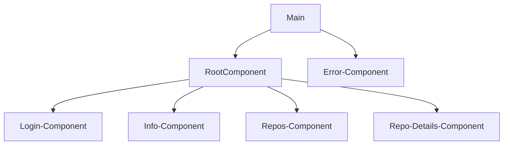

# SPA

This is a simple React app that displays some routes to demonstrate SPA Routing.
Features

    Added pages like Login, Info, and My Repos
    Used React Router to implement routing
    Sidebar to display available routes
    Error handling on route not found
    Active route highlighting

Technologies Used

    React
    Vite
    Typescript
    HTML5
    CSS3

Getting Started

Clone the repository:

    git clone [git url]

Install dependencies:

    cd week-3
    yarn

Run the app:

    yarn dev

    Open the app in your browser at http://127.0.0.1:5173

Usage

    Click on the relevant link to access the route

# App Component Structure

